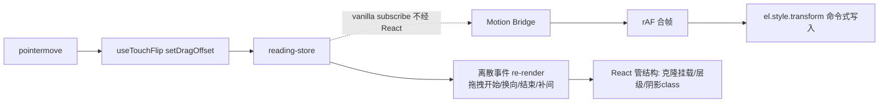

## 用户需求

对阅读器做性能优化专项，目标第一梯队流畅度：

- 解决当前滑动卡顿、掉帧、不跟手问题（覆盖/平移两种横排模式）
- 平移模式流畅度至少对齐并超越原版 Vue 阅读器
- 梳理数据流向，消除重复渲染；评估数据/项目架构合理性

## 产品概述

react-epub-reader 的翻页热路径性能改造。不改任何交互行为与视觉表现，纯性能与数据流优化。拖拽跟手、补间动画、划线、选区、长按等全部既有行为零回归。

## 核心功能

- 拖拽热路径旁路 React：每帧 transform 由命令式 DOM 写入 + rAF 合帧，不再走「store set → 组件 re-render → style diff」
- 消除每帧重复工作：章 HTML 字符串重复包装/大字符串 diff、整组件 vnode 重建、连带订阅者（选区层）每帧 re-render
- 覆盖模式动画状态机保持行为不变（快速连滑打断落定、两阶段转正、右滑锚定手指），仅改造位移写入方式
- 单测 + 浏览器实测帧率前后对比，回归场景全覆盖

## 技术选型

- 沿用现有栈：React 19 + TypeScript + zustand v5 + vitest + oxlint，零新增依赖
- 优化手法为 react-spring/@use-gesture 一脉的标准模式：store 保持逻辑真源，高频运动值经 vanilla `store.subscribe` + rAF 合帧 + 命令式 `el.style.transform` 写入，旁路 React render

## 实现方案

### 诊断结论（已核实）

1. **每帧全组件 re-render**：`useTouchFlip.onPointerMove` → `setDragOffset` → `HorizontalReader`/`PagedReader` 整组件 re-render（vnode 重建、style 对象重分配、3 个章 segment 全量 re-diff）
2. **每帧大字符串处理**：`wrapChapterHtmlWithNav` 每次 render 对全章 HTML 跑正则 + 模板拼接产生新字符串，`dangerouslySetInnerHTML.__html` 全串值比较（3 章 × 60fps 的 O(n) 分配与扫描 → GC 压力）
3. **连带订阅**：`useSelection.ts:74` 订阅 dragOffset 每帧 re-render + effect
4. **PagedReader 拖拽 effect 每帧空跑**：克隆判断逻辑挂在 dragOffset 依赖上
5. **Vue 原版顺滑的原因**：dragOffset 是组件 data，computed trackStyle 只重算 transform 字符串，HTML computed 缓存，每帧成本 ≈ 一次赋值
6. **架构判断**：store 分片（reading-store 高频 slice）与双模式渲染壳划分合理，不重构；只改高频状态的消费方式

### 核心设计：运动桥接层（Motion Bridge）

store 字段（dragOffset/dragStartX/isFlipping/flipAnimating）保留为逻辑真源（判定、复位、取消长按均依赖）。渲染层位移改由桥接 hook 写入：



- **单写者原则**：track/页容器的 transform 与 transition 完全移出 JSX style，由桥接独占写入，避免 React re-render 与命令式写入互相覆盖
- **桥接在任意相关 store 字段变化时基于 getState() 全量重算目标位移**（dragOffset/globalPageIndex/pageStride/rebalance 锁等），天然覆盖提交切页、buffer 重定位等非拖拽场景
- **React 只管低频结构**：克隆层挂载/销毁、z-index 换层、阴影 class、补间启动/落幕（每次翻页 2-3 次 render，可接受）

### 覆盖模式专项设计

- `PageSurfaceView` 根元素 transform/transition 移出 JSX，新增 `rootRef` 暴露根元素；slice 位移（静态）保留 JSX
- `useCoverMotionBridge` 持有当前页/克隆页根 ref：
- 拖拽跟手：首个非零 dragOffset → 解析方向/相邻页 → `showClone` + 置 `dragSession` React 状态（一次 re-render 定层级）；之后每帧 rAF 写移动页 transform；方向翻转 → 重解析 + 一次 re-render 换层
- 补间：`playTween(fromX, targetX)` 命令式双 rAF 启动 280ms ease-out；transitionend/兜底定时器落幕（复用现有 finalizeAnim）
- 打断落定：flipAnimating 期间检测到新 dragOffset → 取消挂起 rAF、清 transition、直接写终点 transform，再走既有 finalizeAnim 状态收尾（行为与现在一致）
- flipAnimating 期间桥接不响应普通 dragOffset 写入，避免与补间打架
- `PagedReader` 的拖拽跟手 effect（283-303）迁移进桥接；render 期 movingX/currentIsMoving 等派生计算改为基于 `animState` + `dragSession`（低频）

### 渲染层瘦身

- `HorizontalReader` 抽 `SegmentView`（React.memo）：bodyRef 经 useMemo 稳定化，html/style 命中缓存时整棵 segment 子树跳过 diff
- `PagedReader` 抽 `ChapterFlow`（React.memo），合并样式对象 useMemo
- `wrapChapterHtmlWithNav` 加以 html 字符串为 key 的有界 LRU 缓存（≤8 条，buffer 窗口 ±1 章足够），同内容零重包装，__html 字符串引用稳定使 React diff O(1) 短路
- `useSelection` 改布尔选择器 `s.dragOffset !== 0`：拖拽开始/结束各一次 re-render；effect 语义保持（非零→cancelPendingLongPress + refreshSelectionPosition）

### 性能与可靠性

- 优化后每帧成本：一次 store set（对象展开）+ 若干 selector 求值（布尔/数值比较 O(1)）+ rAF 内一次 transform 字符串赋值 ≈ Vue 原版
- rAF 合帧：120Hz 触控采样下多 move 合并为一帧一次写；样式写不触发同步布局（handler 内无布局读取，已确认）
- 补间仍由 CSS transition 合成器执行，will-change 既有配置不变

### 执行注意

- trackStyle 的 suppressTransition 含本地状态 bootOverlayVisible：以 `suppressRef` 透传给桥接，组件内镜像更新
- 桥接 mount 立即写一次初始 transform（含 boot 定位），cleanup 取消 rAF 与订阅
- zustand v5 vanilla subscribe 回调签名为 (state, prevState)，自行 diff 关注字段
- 竖滚模式不动；`phase02-stores.test.ts` 等 184 测试基线已确认无 transform/trackStyle JSX 断言，桥接改造不破测试

## 架构设计

分层不变：手势层（useTouchFlip）→ store（逻辑真源）→ **新增运动桥接层（命令式运动写入）** → DOM。React 渲染壳只承担结构（segment/克隆/层级/遮罩）。命名沿用既有 `buffer-rebalance-bridge.ts` 的 bridge 约定。

## 目录结构

```
packages/reader/src/
├── hooks/
│   ├── raf-batcher.ts                  # [NEW] rAF 合帧器（schedule/cancel/flush 纯 TS 模块，可单测）
│   ├── useSlideMotionBridge.ts         # [NEW] 平移模式桥接：subscribe store → rAF 合帧 → track transform/transition 独占写入；suppress 逻辑含 suppressRef 透传；mount 写初始位
│   ├── useSelection.ts                 # [MODIFY] dragOffset 数值订阅 → 布尔选择器（s.dragOffset !== 0）
│   └── __tests__/raf-batcher.test.ts   # [NEW] 合帧/取消/flush 单测（fake rAF）
├── components/content/
│   ├── HorizontalReader.tsx            # [MODIFY] 删 dragOffset 订阅；track 加 ref；trackStyle 移除 transform/transition；挂载桥接；抽 SegmentView React.memo
│   └── paged/
│       ├── useCoverMotionBridge.ts     # [NEW] 覆盖模式桥接：跟手写入/补间 playTween/打断落定/换向重解析；经回调驱动 PagedReader 的 dragSession 离散状态
│       ├── PageSurfaceView.tsx         # [MODIFY] 根 transform/transition 移出 JSX；新增 rootRef；保留 zIndex/moving/CSS 变量/slice
│       └── PagedReader.tsx             # [MODIFY] 删 dragOffset/dragStartX 订阅；拖拽 effect 迁入桥接；startAnim 改调 playTween；抽 ChapterFlow memo + 样式 useMemo
└── core/chapter-nav/index.ts           # [MODIFY] wrapChapterHtmlWithNav 有界 LRU 缓存（key=html 字符串，≤8 条）
```

## 关键代码结构

```ts
// hooks/raf-batcher.ts — rAF 合帧器
export interface RafBatcher {
  schedule(task: () => void): void  // 同帧多次调用只执行最后一次 task
  cancel(): void
}
export function createRafBatcher(): RafBatcher

// components/content/paged/useCoverMotionBridge.ts — 覆盖桥接对外契约
export interface CoverMotionBridge {
  playTween(target: 'current' | 'clone', fromX: number, targetX: number): void
  settle(target: 'current' | 'clone', x: number): void  // 无过渡立即落定（打断路径）
}
```

## Agent Extensions

### Skill

- **playwright-cli**
- Purpose: h5-demo 浏览器实测：注入 rAF 帧间隔探针统计拖拽掉帧率（优化前后对比），并执行回归场景清单（快速连滑/跨章/换向/回弹/点击分区/长按选中/首末页阻尼）
- Expected outcome: 产出可量化的帧率对比数据与回归验证结果，确认跟手性达预期