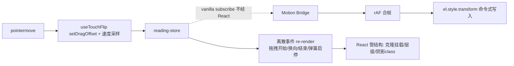

## 用户需求

对阅读器做性能优化专项，目标第一梯队流畅度与手感：

- 解决当前滑动卡顿、掉帧、不跟手问题（覆盖/平移两种横排模式）
- 平移模式流畅度至少对齐并超越原版 Vue 阅读器
- 引入「物理翻页」手感：松手带初速度、fling 快速甩动直接翻页、弹簧曲线、动画可被新手势打断接管
- 梳理数据流向，消除重复渲染；评估数据/项目架构合理性
- 依赖决策已对齐：不装 react-spring，物理弹簧用自研轻量积分器，零新增依赖

## 产品概述

react-epub-reader 的翻页热路径性能 + 手感改造。不改交互语义与视觉表现：拖拽跟手、划线、选区、长按等既有行为零回归；松手动画从固定 280ms 线性补间升级为速度连续的物理弹簧。

## 核心功能

- 拖拽热路径旁路 React：每帧 transform 由命令式 DOM 写入 + rAF 合帧，不再走「store set → 组件 re-render → style diff」
- 消除每帧重复工作：章 HTML 重复包装/大字符串 diff、整组件 vnode 重建、选区层每帧 re-render
- 物理弹簧翻页：速度采样 + fling 判定（快甩无视 40px 阈值直接翻页）+ 弹簧补间（可打断、可接管）
- 覆盖模式动画状态机保持行为不变（快速连滑打断落定、两阶段转正、右滑锚定手指），仅替换位移驱动方式
- 单测 + 浏览器实测帧率前后对比 + 回归场景全覆盖

## 技术选型

- 沿用现有栈：React 19 + TypeScript + zustand v5 + vitest + oxlint，**零新增依赖**
- 运动优化采用 react-spring/@use-gesture 一脉的标准模式：store 保持逻辑真源，高频运动值经 vanilla `store.subscribe` + rAF 合帧 + 命令式 `el.style.transform` 写入，旁路 React render
- 物理弹簧自研 ~60 行积分器（core/motion，纯 TS、注入 now() 可单测），比 react-spring 更贴合覆盖模式自研状态机（打断落定/两阶段转正）

## 实现方案

### 诊断结论（已核实源码）

1. **每帧全组件 re-render**：`useTouchFlip.onPointerMove` → `setDragOffset` → `HorizontalReader.tsx:73`/`PagedReader.tsx:104` 整组件 re-render（3 章 segment vnode 重建、style 对象重分配）
2. **每帧大字符串处理**：`wrapChapterHtmlWithNav`（core/chapter-nav/index.ts:63，regex test + 模板拼接产生新全串）+ `dangerouslySetInnerHTML.__html` 全串值比较，60fps 下 O(n) 分配与扫描 → GC 压力
3. **连带订阅**：`useSelection.ts:74` 订阅 dragOffset 每帧 re-render + effect
4. **PagedReader 拖拽 effect 每帧空跑**：PagedReader.tsx:283-303 克隆判断挂在 dragOffset 依赖上
5. **buffer 整对象订阅**：测量期任何 patch 触发全组件 re-render + HTML 重包装
6. **Vue 原版顺滑原因**：trackStyle computed 每帧只重算 transform 字符串，HTML computed 缓存，每帧成本 ≈ 一次赋值
7. **架构判断**：store 分片与双模式渲染壳划分合理，不重构；只改高频状态消费方式

### 核心设计一：运动桥接层（Motion Bridge）



- **单写者原则**：track/页容器的 transform 与 transition 完全移出 JSX style，由桥接独占写入，避免 React 与命令式写入互相覆盖
- **桥接在任意相关 store 字段变化时基于 getState() 全量重算目标位移**（dragOffset/globalPageIndex/pageStride/rebalance 锁等），天然覆盖提交切页、buffer 重定位等非拖拽场景
- **React 只管低频结构**：克隆挂载/销毁、z-index 换层、阴影 class、弹簧启动/落幕（每次翻页 2-3 次 render）

### 核心设计二：物理弹簧翻页

- **弹簧积分器** `core/motion/spring.ts`：半隐式欧拉积分（固定 4ms 子步进，帧率无关），参数 stiffness/damping/mass，调参目标 ≈280ms ease-out 观感但速度连续；API `createSpringAnimation({from,to,velocity,onUpdate,onComplete}) → {cancel()}`；落定判定 |x-to|<0.5px 且 |v|<0.01px/ms；rAF 驱动可取消
- **速度跟踪**：useTouchFlip 在 pointermove 维护最近 ~100ms 采样环形缓冲（t,x），松手计算速度 px/ms
- **fling 判定**：|v| ≥ 0.3 px/ms（≈300px/s，可调常量）且方向与拖拽位移一致 → 直接提交翻页（无视 40px 位置阈值）；否则走原 `resolveGlobalDragTurn` 位置阈值（40px 行为保持）
- **松手动画统一走弹簧**：拖拽松手（velocity=松手速度）、点击翻页（velocity=0）两模式一致；打断落定 = cancel 弹簧 + 立即写终点（复用现有 finalizeAnim 路径）
- **落定收尾**：弹簧 onComplete → 现有 finalizeAnim/turnPage 状态收尾 + isFlipping 阴影复位（替代 290ms 定时器）；保留 ~400ms 硬超时兜底
- **rebalance/layoutLocked/silentExpand 期间**：跳过弹簧直接写终值（对应现有 suppressTransition 语义）

### 渲染层瘦身

- `HorizontalReader` 抽 `SegmentView`（React.memo）：bodyRef 经 useMemo 稳定化，html/style 命中缓存时整棵 segment 子树跳过 diff
- `PagedReader` 抽 `ChapterFlow`（React.memo），合并样式对象 useMemo
- `wrapChapterHtmlWithNav` 加以 html 字符串为 key 的有界 LRU 缓存（≤8 条，buffer 窗口 ±1 章足够）：同内容返回同一字符串引用，React `__html` diff O(1) 短路
- `useSelection` 改布尔选择器 `s.dragOffset !== 0`：拖拽开始/结束各一次 re-render，effect 语义保持

### 性能与可靠性

- 优化后每帧成本：一次 store set + 若干 O(1) selector 求值 + rAF 内一次 transform 赋值 ≈ Vue 原版
- rAF 合帧：120Hz 触控采样下多 move 合并为一帧一次写；handler 内无布局读取（已确认），不触发同步布局
- 弹簧动画每帧仅 JS 积分 + 一次 transform 写入；transform/opacity 走合成器，will-change 既有配置不变

### 执行注意

- trackStyle 的 suppressTransition 含本地 bootOverlayVisible：以 `suppressRef` 透传桥接，组件内镜像更新
- 桥接 mount 立即写一次初始 transform（含 boot 定位），cleanup 取消 rAF/弹簧/订阅
- zustand v5 vanilla subscribe 回调签名 (state, prevState)，自行 diff 关注字段
- 竖滚模式不动；184 测试基线无 transform/trackStyle JSX 断言，桥接改造不破测试
- 弹簧参数以「视觉时长 ≈280ms、无过冲或轻微过冲」调定，常量集中 export 便于后续调手感

## 架构设计

分层不变：手势层（useTouchFlip + 速度采样）→ store（逻辑真源）→ **运动桥接层（命令式运动写入 + 弹簧驱动）** → DOM。React 渲染壳只承担结构（segment/克隆/层级/遮罩）。命名沿用既有 `buffer-rebalance-bridge.ts` 的 bridge 约定。

## 目录结构

```
packages/reader/src/
├── core/
│   ├── motion/
│   │   └── spring.ts                  # [NEW] 弹簧积分器：半隐式欧拉固定步进，createSpringAnimation({from,to,velocity,onUpdate,onComplete})→{cancel}；落定判定与调参常量集中 export
│   ├── __tests__/spring.test.ts       # [NEW] 弹簧收敛/取消/速度连续/落定判定单测（注入 now 与 rAF mock）
│   └── chapter-nav/index.ts           # [MODIFY] wrapChapterHtmlWithNav 加有界 LRU 缓存（key=html 字符串，≤8 条），返回引用稳定
├── hooks/
│   ├── raf-batcher.ts                 # [NEW] rAF 合帧器（schedule/cancel，同帧多次调用只执行最后一次 task）
│   ├── useSlideMotionBridge.ts        # [NEW] 平移桥接：subscribe store → rAF 合帧 → track transform 独占写入；提交/回弹改弹簧驱动；suppressRef 透传；mount 写初始位
│   ├── useTouchFlip.ts                # [MODIFY] pointermove 速度采样环形缓冲；松手计算 velocity 经 onTurnPage/内部判定透传；fling 阈值判定；isFlipping 收尾改由弹簧完成回调
│   ├── useSelection.ts                # [MODIFY] dragOffset 数值订阅 → 布尔选择器（s.dragOffset !== 0）
│   └── __tests__/raf-batcher.test.ts  # [NEW] 合帧/取消单测（fake rAF）
└── components/content/
    ├── HorizontalReader.tsx           # [MODIFY] 删 dragOffset 订阅；track 加 ref；trackStyle 移除 transform/transition；挂载桥接；抽 SegmentView React.memo
    └── paged/
        ├── useCoverMotionBridge.ts    # [NEW] 覆盖桥接：跟手 rAF 写入/弹簧 playSpring/打断落定/换向重解析；经回调驱动 PagedReader 离散 dragSession 状态
        ├── PageSurfaceView.tsx        # [MODIFY] 根 transform/transition 移出 JSX；新增 rootRef；保留 zIndex/moving/CSS 变量/slice；onTransitionEnd 让位弹簧完成回调
        └── PagedReader.tsx            # [MODIFY] 删 dragOffset/dragStartX 订阅；拖拽 effect 迁入桥接；startAnim 改调桥接弹簧；抽 ChapterFlow memo + 样式 useMemo
```

## 关键代码结构

```ts
// core/motion/spring.ts — 弹簧动画（纯 TS，可单测）
export interface SpringConfig { stiffness: number; damping: number; mass: number }
export interface SpringAnimationInput {
  from: number; to: number; velocity: number   // velocity: px/ms
  config?: Partial<SpringConfig>
  onUpdate: (x: number) => void
  onComplete: () => void
}
export function createSpringAnimation(input: SpringAnimationInput): { cancel(): void }

// components/content/paged/useCoverMotionBridge.ts — 覆盖桥接对外契约
export interface CoverMotionBridge {
  playSpring(target: 'current' | 'clone', fromX: number, targetX: number, velocity: number): void
  settle(target: 'current' | 'clone', x: number): void  // 无动画立即落定（打断路径）
}
```

## Agent Extensions

### Skill

- **playwright-cli**
- Purpose: h5-demo 浏览器实测：注入 rAF 帧间隔探针统计拖拽掉帧率（优化前后对比），并执行回归场景清单（快速连滑/跨章/换向/回弹/fling/点击分区/长按选中/首末页阻尼）
- Expected outcome: 产出可量化的帧率对比数据与回归验证结果，确认跟手性与物理手感达预期