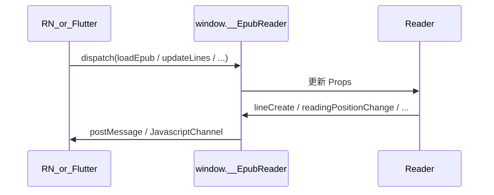

# react-epub-reader

将 Vue 2 H5 阅读器 1:1 复刻为 **React 19 + TypeScript** monorepo：数据由宿主 Props 驱动，阅读器 UI 状态内聚，可独立发布为 npm 包或嵌入自有 H5/App WebView。

完整契约与迁移记录见 [`plans/00-总览与契约.md`](plans/00-总览与契约.md)、进度见 [`plans/STATUS.md`](plans/STATUS.md)。

---

## 功能概览

| 能力 | 说明 |
|---|---|
| 双模式阅读 | 横划翻页 / 竖滚单章，设置持久化（`localStorage: h5-reader-settings`） |
| 目录 / 设置 / 字体 | 主题、亮度、行距、字号 6 档、字重 3 档、护眼模式 |
| 划线 / 批注 / 书签 | 乐观 UI + `clientId` reconcile；失败经 `annotationFailure` 回滚 |
| 笔记中心 | 三 Tab（划线 / 批注 / 书签），列表跳转定位 |
| 阅读进度 | debounce 800ms + 30s 定时上报；`initialPosition` 还原 |
| TTS 语音朗读 | `onTtsAudioRequest` → 宿主取音频 → `ttsAudioUrl` 注入 |
| 富媒体 | 图片预览、脚注 Popover、正文链接 `onLinkClick` |
| 书籍 CSS | 宿主 `bookMeta` 含外部 CSS 时自动注入与同步 |
| EPUB | `@react-epub-reader/epub-adapter` 解析 spine → 统一章节契约 |
| WebView Bundle | 编译为 `html/css/js`，嵌入 RN / Flutter WebView，JSON 协议双向通信 |
| 业务插槽 | 随感等通过 `chromeSlots` 注入，reader 包零内置业务 |

---

## 包结构

```
react-epub-reader/
├── packages/reader/          # 阅读器库（零 fetch / 零路由 / 零 USE_MOCK）
├── packages/epub-adapter/    # epub.js → ChapterMeta / ChapterContent
├── packages/webview-bundle/  # WebView 静态包 + Native bridge 协议
├── apps/h5-demo/             # 集成示例：Mock API、ReaderHost、随感、EPUB 调试
└── plans/                    # 契约、Phase 计划、验收看板
```

| 包 | npm name | 职责 |
|---|---|---|
| `packages/reader` | `@react-epub-reader/reader` | `<Reader />` 组件 + 全部阅读能力 |
| `packages/epub-adapter` | `@react-epub-reader/epub-adapter` | EPUB 加载、章节 HTML、资源 rewrite |
| `packages/webview-bundle` | `@react-epub-reader/webview-bundle` | 构建可嵌入 App WebView 的静态 bundle + JSON bridge |
| `apps/h5-demo` | `@react-epub-reader/h5-demo` | 宿主参考实现：API、路由、ReaderHost |

---

## 设计理念

- **数据无状态**：章节、标注、用户态由宿主 Props 注入；reader 不发起网络请求。
- **UI 状态内聚**：选区、翻页、主题、弹窗、TTS 会话等在 reader 内部 store 管理。
- **乐观 UI**：划线/批注先改 DOM 并写 pending，宿主 API 成功后再 reconcile；失败走 `annotationFailure`。
- **业务可插拔**：随感、详情页跳转等只在 `apps/h5-demo`；reader 通过 `chromeSlots` + `navigate` 扩展。

---

## 环境要求

- **Node.js 22+**（见根目录 `.nvmrc`）
- **pnpm**（workspace monorepo）

```bash
nvm use
pnpm install
```

---

## 本地运行（h5-demo）

```bash
pnpm dev
```

浏览器打开后默认进入示例书阅读页（**H5 组件模式**）：

**http://localhost:5173/book/12535542/read**

### 三种演示模式（DevPanel 切换）

| 模式 | 说明 |
|---|---|
| **H5 组件** | 直挂 `<Reader />` + `ReaderHost` + React Router（随感等业务路由） |
| **WebView 模拟 · API** | `<iframe src="/webview/">` 加载 webview-bundle，父页 Mock Native 通过 bridge 发 `loadBook` / `injectChapter` |
| **WebView 模拟 · EPUB** | 同上 iframe，通过 `loadEpub` 加载 `sample.epub` 或本地文件 |

WebView 模式在 DevTools 中可见 `data-webview-iframe="true"` 的 iframe；父页通过 `window.EpubReaderBridge` 与 iframe 内 `parent.EpubReaderBridge.postMessage` 通信。

`pnpm dev` 会**同时启动** h5-demo（:5173）与 webview-bundle（:5174），前者将 `/webview` 代理到后者以保持同源。仅调试 webview-bundle 时可单独 `pnpm dev:webview`。

### 标注本地持久化

划线 / 批注 / 书签写入 `localStorage`（key：`h5-demo-annotations:v1:{scope}`），刷新后可回显：

| scope | 适用场景 |
|---|---|
| `book:12535542` | H5 组件、WebView API 模式 |
| `epub:sample` | WebView EPUB · sample.epub |
| `epub:file:{文件名}` | WebView EPUB · 本地文件 |

实现见 [`apps/h5-demo/src/storage/annotation-storage.ts`](apps/h5-demo/src/storage/annotation-storage.ts)。

### 路由（H5 组件模式）

| 路径 | 说明 |
|---|---|
| `/` | 重定向到 `/book/12535542/read` |
| `/book/:id/read` | Mock API 阅读页（`ReaderHost` 桥接） |
| `/book/:id/thoughts` | 随感列表 |
| `/book/:id/thoughts/write` | 写随感 |

### DevPanel（仅开发环境）

右上角 DevPanel 可切换演示模式，并提供：

| 选项 | 说明 |
|---|---|
| H5 组件（直挂 Reader） | 默认；走 Mock API + 完整宿主链路 |
| WebView 模拟 · API 模式 | bridge `loadBook` + 按需 `injectChapter` |
| WebView 模拟 · EPUB 模式 | bridge `loadEpub`；可选 sample / 本地文件 |
| USE_MOCK | 仅 H5 模式；实际需 `VITE_USE_MOCK=false` 并**刷新**后走真实 HTTP |
| 划线/批注/书签失败 | 模拟下次保存失败，验证 rollback |

Mock 示例书 **第二章** 含富媒体（图片 / 脚注 / 外链），适合 smoke 测试。

### 本地运行（webview-bundle）

面向 App WebView 集成的静态包，独立 dev server：

```bash
pnpm dev:webview
```

浏览器打开 **http://localhost:5174/webview/**，在控制台手动注入 EPUB：

```javascript
window.__EpubReader.dispatch(JSON.stringify({
  v: 1,
  type: 'loadEpub',
  payload: {
    bookId: 1,
    source: { kind: 'url', data: '/sample.epub' }
  }
}))
```

### 环境变量

在 `apps/h5-demo` 下创建 `.env`（可选）：

```bash
# 默认 true；设为 false 后刷新页面，API 走真实 HTTP（需配置后端）
VITE_USE_MOCK=false
```

Mock 公共参数（与 Vue 一致）：`rentId=105883`、`appId=13673ce1`（见 `apps/h5-demo/src/api/request-helper.ts`）。

---

## 构建与测试

```bash
pnpm -r run build    # 四包构建（含 webview-bundle dist）
pnpm -w test         # 162 项单测（reader + epub-adapter）
pnpm lint            # oxlint
pnpm preview         # 预览 h5-demo 生产构建
pnpm dev:webview     # 开发 webview-bundle（:5174）
```

---

## 集成到自己的宿主

### 1. 依赖阅读器包

```tsx
import { Reader, type ReaderProps } from '@react-epub-reader/reader'
import '@react-epub-reader/reader/dist/reader.css'
```

### 2. 注入 Props + 回调

宿主负责：**拉书元数据 / 章列表 / 章 HTML / 标注 / 进度 / TTS 音频**，通过 Props 传入；阅读器通过回调通知 **切章、预取、标注 CRUD、进度上报、登录拦截** 等。

最小示例：

```tsx
<Reader
  bookId={bookId}
  initialChapterId={2}
  initialPosition={savedSnapshot}
  chapterList={chapterList}
  chapters={chaptersMap}
  chapterAccess={chapterAccess}
  chapterLoadStates={chapterLoadStates}
  lines={lines}
  notes={notes}
  bookmarks={bookmarks}
  bookMeta={bookMeta}
  user={{ isLoggedIn: true, inBookshelf: false }}
  ttsVoiceTypes={voiceTypes}
  ttsAudioUrl={ttsAudioUrl}
  navigate={(path) => router.push(path)}
  onChapterChange={(chapterId, width) => fetchChapter(chapterId, width)}
  onPrefetch={(ids, width) => prefetchChapters(ids, width)}
  onLineCreate={handleLineCreate}
  onReadingPositionChange={savePosition}
  onTtsAudioRequest={fetchAndInjectTts}
  onLinkClick={(href) => window.open(href, '_blank')}
  annotationFailure={failureSignal}
/>
```

完整 Props / 回调表见 [`plans/00-总览与契约.md`](plans/00-总览与契约.md) §5–§6。

### 3. 参考实现

| 文件 | 作用 |
|---|---|
| [`apps/h5-demo/src/host/ReaderHost.tsx`](apps/h5-demo/src/host/ReaderHost.tsx) | bootstrap、懒加载 ±1 章、标注 reconcile、TTS、首屏 loading |
| [`apps/h5-demo/src/host/host-store.ts`](apps/h5-demo/src/host/host-store.ts) | 宿主数据态 |
| [`apps/h5-demo/src/api/*`](apps/h5-demo/src/api/) | Mock / 真实 API 模块 |
| [`apps/h5-demo/src/slots/thoughts-menu.tsx`](apps/h5-demo/src/slots/thoughts-menu.tsx) | 随感插槽示例 |

更细的插槽用法、乐观 UI 时序见 [`packages/reader/README.md`](packages/reader/README.md)。

### 4. EPUB 数据源

```tsx
import { createEpubAdapter } from '@react-epub-reader/epub-adapter'

const adapter = createEpubAdapter()
const chapterList = await adapter.loadEpub(fileOrUrl)
const content = await adapter.getChapterContent(chapterId)
// 将 content 填入 ReaderProps.chapters[chapterId]
```

WebView EPUB 模式参考 [`apps/h5-demo/src/modes/webview/`](apps/h5-demo/src/modes/webview/)。

---

## 嵌入 App WebView（webview-bundle）

`packages/webview-bundle` 将 reader + epub-adapter + bridge 打成 **单份静态资源**，供 React Native / Flutter WebView 直接加载，无需 App 侧再装 React 依赖。

### 构建产物

```bash
pnpm --filter @react-epub-reader/webview-bundle build
```

```
packages/webview-bundle/dist/
├── index.html
├── assets/
│   ├── index.js    # 含 reader + epub-adapter + bridge
│   └── index.css   # reader 样式
└── docs/
    ├── PROTOCOL.md   # Bridge 协议（随包分发，便于 AI 接入）
    └── examples/   # RN / Flutter 参考代码
```

> **AI 接入**：App 工程内 `@dist/docs/PROTOCOL.md` 或 `@dist/docs` 即可带入协议与示例，无需额外说明。

将 `dist/` 打入 App assets（RN：`file:///android_asset/webview/index.html`；Flutter：`assets/webview/index.html`）。

### 通信架构

协议与传输分离：WebView 内只认统一 JSON 格式；RN / Flutter 各用薄适配层对接。

| 方向 | 机制 |
|---|---|
| App → WebView | `window.__EpubReader.dispatch(jsonString)`（RN `injectJavaScript` / Flutter `runJavaScript`） |
| WebView → App | 自动探测 `ReactNativeWebView.postMessage` / `EpubReaderBridge` / `flutter_inappwebview.callHandler` |



### 常用命令（App → WebView）

| type | 用途 |
|---|---|
| `loadEpub` | 加载 EPUB（`source.kind`: `url` 或 `base64`） |
| `loadBook` | API 模式 bootstrap（App 请求后端后注入全书元数据 + 首章 HTML） |
| `injectChapter` | API 模式按需注入单章（响应 `chapterChange` / `prefetch`） |
| `updateChapterAccess` | 批量更新章节权限（付费解锁后） |
| `epubChunk` | 大文件分片传输 |
| `updateLines` / `updateNotes` / `updateBookmarks` | 注入或更新标注 |
| `injectTtsAudio` | TTS 音频回注（响应 `ttsAudioRequest` 事件） |
| `signalAnnotationFailure` | 标注保存失败，触发 DOM rollback |
| `updateUser` | 更新登录 / 书架态 |
| `destroy` | 卸载当前书籍 |

### 数据源模式

| 模式 | 入口 | 章节来源 | 切章 |
|------|------|---------|------|
| EPUB | `loadEpub` | WebView 内 epub-adapter 解析 | WebView 自行取章 |
| API | `loadBook` | App 请求后端后注入 | WebView 发 `chapterChange`，App 回注 `injectChapter` |

API 模式对齐 [`ReaderHost`](apps/h5-demo/src/host/ReaderHost.tsx)：所有 fetch 在 App 层完成，WebView 零网络请求。Bootstrap 时 App 并行拉取 bookMeta/chapterList/标注/进度，再请求首章 HTML 后 `loadBook`；切章时监听 `chapterChange` 事件，请求后端后 `injectChapter`。

WebView 会将 Reader 全部回调映射为事件上报 App，包括 `lineCreate`、`readingPositionChange`、`ttsAudioRequest`、`navigate`（随感等）等。

### 集成示例

**React Native**（[`docs/examples/rn-bridge.ts`](packages/webview-bundle/docs/examples/rn-bridge.ts)）：

```tsx
import { createRnBridge, parseBridgeMessage } from './rn-bridge'

const ref = useRef<WebView>(null)
const bridge = createRnBridge(ref)

<WebView
  ref={ref}
  source={{ uri: 'file:///android_asset/webview/index.html' }}
  onMessage={(e) => {
    const msg = parseBridgeMessage(e.nativeEvent.data)
    if (msg?.type === 'lineCreate') { /* 调 API 保存 */ }
  }}
  onLoadEnd={() => bridge.loadEpub(epubFileUrl)}
/>
```

**Flutter**（[`docs/examples/flutter_bridge.dart`](packages/webview-bundle/docs/examples/flutter_bridge.dart)）：

```dart
controller.addJavaScriptChannel('EpubReaderBridge',
  onMessageReceived: (msg) => _handleBridge(msg.message));
await controller.loadFlutterAsset('assets/webview/index.html');
await controller.runJavaScript(
  "window.__EpubReader.dispatch('${jsonEncode(loadEpubCmd)}')");
```

完整协议与 payload 字段见 [`packages/webview-bundle/docs/PROTOCOL.md`](packages/webview-bundle/docs/PROTOCOL.md)。

> **大文件建议**：Native 先将 EPUB 写入 App 沙盒，再发 `loadEpub` 传 `file://` URL；超大文件可用 `epubChunk` 分片拼接。

---

## 插槽示例（随感入口）

```tsx
<Reader
  chromeSlots={{
    topBarMoreMenu: (ctx) => (
      <button
        type="button"
        className="reader-top-bar__menu-item"
        onClick={() => ctx.navigate(`/book/${ctx.bookId}/thoughts`)}
      >
        随感
      </button>
    ),
  }}
  navigate={navigate}
  {...otherProps}
/>
```

---

## 契约要点（摘要）

| 主题 | 约定 |
|---|---|
| 标注 reconcile | 划线/批注用 `clientId`（= webLineId/webNoteId）；书签用 `id` |
| API 失败 | 宿主注入 `annotationFailure`（`nonce` 递增）→ DOM 回滚 + Toast |
| TTS | fire-and-forget `onTtsAudioRequest`；宿主用 `ttsAudioUrl` 按 `reqId` 注入 |
| 切章宽度 | `onChapterChange(chapterId, width)`，`width` 为容器实测（默认 398） |
| reader 边界 | 包内禁止 `fetch`、`USE_MOCK`、`react-router` |

---

## 开发计划

- [x] Phase 0 — monorepo 基建
- [x] Phase 1 — core 纯函数引擎 + 单测
- [x] Phase 2 — 双模式阅读引擎
- [x] Phase 3 — 壳层 / 设置 / 目录 / 插槽
- [x] Phase 4 — 选中 / 划线 / 批注 + 乐观 UI
- [x] Phase 5 — 笔记中心 / 书签 / 进度
- [x] Phase 6 — TTS
- [x] Phase 7 — Epub Adapter
- [x] Phase 8 — H5 宿主 API + ReaderHost
- [x] Phase 9 — 富媒体 / 书 CSS / 随感 / 文档

**迁移主链路已闭环。** 可选后续：EPUB 标注 CFI、Playwright 视觉回归、`BookMeta.cssLists` 契约化、reader bundle code-split。

---

## 相关文档

- [总览与契约](plans/00-总览与契约.md)
- [迁移状态看板](plans/STATUS.md)
- [阅读器库文档](packages/reader/README.md)
- [WebView Bridge 协议](packages/webview-bundle/docs/PROTOCOL.md)
- [Plans 工作流](plans/README.md)
